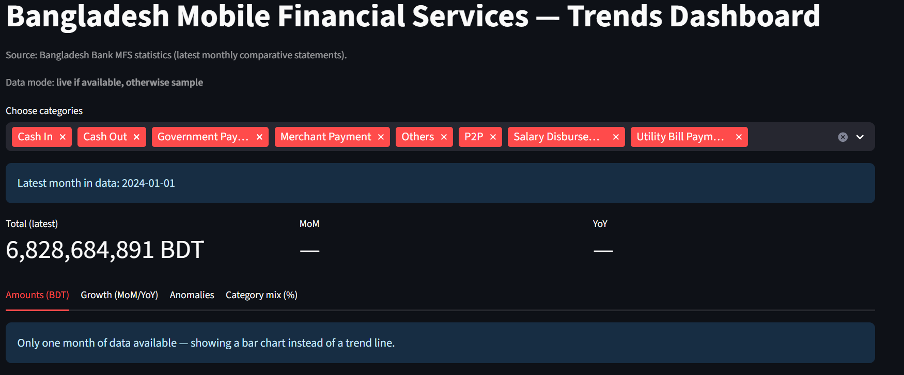
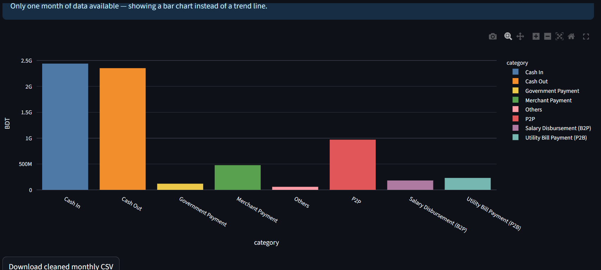
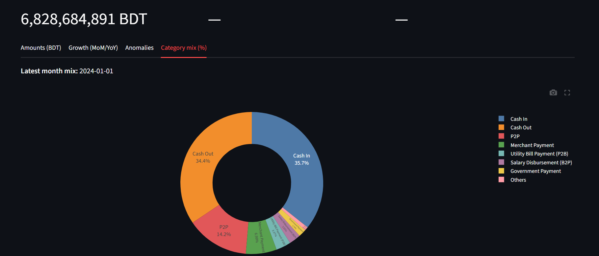
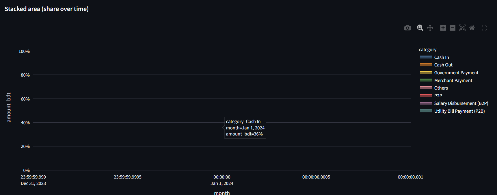

# Bangladesh Mobile Financial Services — Trends Dashboard

[](LICENSE)


An interactive **Streamlit** dashboard that ingests **Bangladesh Bank MFS** (Mobile Financial Services) tables (HTML/PDF), cleans them into monthly time series, and visualizes:

- **Amounts** by category (Cash In/Out, P2P, Merchant, Utility, Govt, Salary, Others)
- **MoM / YoY** growth
- **Seasonality & anomalies** (STL residuals)
- **Category mix** (donut + stacked area by %)
- **Downloadable CSV** of the cleaned data

> **Data mode:** the app automatically uses **live data** when available, and falls back to a **small sample dataset** if the source page/PDF is unavailable. You can force live-only mode with `MFS_ALLOW_SAMPLE=0`.

---

## 🚀 Live Demo

🔗 **App:** <https://<your-streamlit-url>>  
💻 **Code:** <https://github.com/Shamma-Samiha/mfs-trends-bd.git>

---

## 📸 Screenshots

Embed them like this:

<p align="center">
  
  
</p>
<p align="center">
  
  
</p>

---

## 🧭 Table of Contents

- [Features](#-features)
- [Tech Stack](#-tech-stack)
- [Project Structure](#-project-structure)
- [Quickstart (Local)](#-quickstart-local)
- [Run Tests](#-run-tests)
- [Deploy (Streamlit Cloud)](#-deploy-streamlit-cloud)
- [Methodology](#-methodology)
- [Troubleshooting](#-troubleshooting)
- [Roadmap](#-roadmap)
- [License](#-license)

---

## ✨ Features

- **Robust ingestion**: tries HTML tables first; if structure changes, falls back to latest MFS PDF; if both fail, uses a **sample dataset** so the app still runs.
- **Clean ETL**: normalize headers, melt wide tables, parse dates, convert **crore BDT → BDT** (× 1e7).
- **Time-series analytics**: monthly aggregates, **MoM/YoY growth**, and **STL-based anomaly flags**.
- **Interactive UI**: category multiselect, moving-average smoothing, growth heatmap, donut chart, stacked area by share, CSV export.
- **CI-ready**: minimal **pytest** + **GitHub Actions** workflow.

---

## 🧰 Tech Stack

- **Python** · **pandas** · **numpy**
- **Streamlit** (UI)
- **plotly** (interactive charts)
- **statsmodels** (STL decomposition)
- **requests** · **BeautifulSoup** · **lxml** (HTML) · **pdfplumber** (PDF)

---

## 🗂 Project Structure

mfs-trends-bd/
├─ app/
│ └─ streamlit_app.py # Streamlit UI
├─ src/
│ ├─ init.py
│ ├─ fetch.py # fetch HTML/PDF (live) or sample data
│ ├─ etl.py # cleaning: tidy monthly format
│ └─ metrics.py # aggregates, growth, anomalies
├─ tests/
│ └─ test_metrics.py # tiny example test
├─ .github/workflows/ci.yml # GitHub Actions (pytest on push)
├─ .streamlit/config.toml # (optional) theme config
├─ requirements.txt
├─ README.md
├─ LICENSE
└─ assets/ # screenshots (not required but recommended)

---
📫 Contact
- LinkedIn: <https://www.linkedin.com/in/shamma-samiha-4b029b246/>
- GitHub: <https://github.com/Shamma-Samiha>
- Email: <shmmsamiha@gmail.com>
  
## ⚡ Quickstart (Local)

> Use a virtual environment; run these **from the project root**.

**Windows (PowerShell)**
```powershell
python -m venv .venv
.\.venv\Scripts\Activate.ps1
pip install -r requirements.txt
streamlit run app\streamlit_app.py


